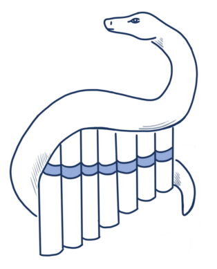

# pytest: Simple, rapid and fun testing with Python

## Setup instructions

- We'll be using pytest on the commandline for the training.
- If you use PyCharm:
    - Open the `code/` folder as a project
    - Open `basic/test_calc.py`, configure Python interpreter
    - Wait until "Install requirements" prompt appears and accept
    - Open a terminal inside PyCharm
- If you use VS Code:
    - Open the `code/` folder as a project
    - Ctrl-Shift-P to open command palette, run "Python: Create Environment..."
    - Select `venv` and `requirements.txt` for installation
    - Click beaker icon in the sidebar, you should see a tree of tests (some will fail when running them)
    - Open a terminal inside VS Code
- Manual setup:
    - [Create a virtualenv](https://chriswarrick.com/blog/2018/09/04/python-virtual-environments/) and activate it (or substitute tool paths below)
    - `pip install -r code/requirements.txt`
- Check everything works:
    - Check `python3 --version` (Windows: `py -3 --version`), make sure you run 3.8 or newer.
    - Check `pytest --version`, you should see 8.4.x ideally (7.0+ is ok)
- In case of trouble/questions, please feel free to ask! Any of these will work fine:
    - [`florian@bruhin.software`](mailto:florian@bruhin.software)
    - IRC: `The-Compiler` on [Libera Chat](https://libera.chat/)
    - [`@the_compiler` on Discord](https://discord.com/users/329364263896481802) (e.g. [Python Discord](https://www.pythondiscord.com/) or [EuroPython Discord](https://ep2025.europython.eu/discord))

## Preparation

If you want to prepare, take a look at `rpncalc/` (especially `rpn_v2.py` and
`utils.py`), which is a small example project we'll use in the training.
